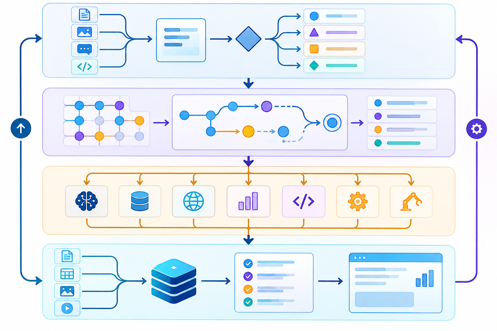

# Cognitive Skills Engine — Advanced Edition


**A compatibility-first cognitive architecture for deterministic task routing, evidence-aware traces, and reusable expert skills.**

This repository contains the **v2 runtime** and a preserved, read-only snapshot of the original v1 Cognitive Skills Engine. v2 is deliberately modest about what an orchestration layer can prove: it routes work, records the route, attaches provenance, and makes uncertainty visible. It does not claim consciousness, human-level reasoning, or automatic validation of external facts.

## What is new in v2

- **Deterministic routing** from a task description to the 6×4 board vocabulary.
- **Explicit synthesis and output stages** for multi-domain tasks.
- **Trace objects** with a stable schema, evidence records, confidence, limitations, and uncertainty state.
- **Compatibility-first skill loading** for the v1 directory structure.
- **Zero runtime dependencies** in the new `v2/` engine; Node.js 18 or newer is enough.
- **CLI and programmatic APIs** suitable for experiments, notebooks, agent adapters, and service wrappers.
- **Automated tests and CI** that exercise routing and evidence handling without requiring an API key.

The historical extension, browser package, integrations, and expert prompts remain available. Nothing from the earlier release has been deleted; see [Version history](#version-history).

## Architecture at a glance



The runtime treats a task as a small, inspectable pipeline:

`D5 Master Router → A1 Token Compression → expert cells → D3/D4 synthesis → D6 Output Renderer`

Expert cells are selected by transparent keyword rules in `v2/engine.mjs`. The rules are intentionally inspectable and deterministic; they are a routing aid, not a substitute for domain review. A task that matches several scientific cells is sent through `D3`; a mixed-domain task is also given an explicit synthesis step.

## Quick start

```bash
git clone https://github.com/Agnuxo1/Cognitive-Skills-Engine-Advanced.git
cd Cognitive-Skills-Engine-Advanced

# Run the dependency-free v2 test suite
npm run test:v2

# Route a task (the command reads the remaining command-line text)
node v2/cli.mjs route "Design a robot skin with tactile sensors and a safe control loop"

# Emit a complete evidence-aware trace
node v2/cli.mjs trace "Compare two sensor materials" \
  --source "bench-note-2026-09-22" \
  --method "controlled comparison" \
  --claim "Material A produced the larger response" \
  --confidence 0.82

# Inspect the complete board manifest
node v2/cli.mjs manifest
```

The CLI prints JSON so it can be piped into another process. No network access or model credential is required for the local routing and trace operations.

## Programmatic API

```js
import {
  routeTask,
  createTrace,
  addEvidence,
  responseEnvelope,
} from "./v2/engine.mjs";

const routed = routeTask("Evaluate a polymer sensor in a robotic hand");
let trace = createTrace("Evaluate a polymer sensor in a robotic hand", routed);

trace = addEvidence(trace, {
  source: "lab-notebook/2026-09-22",
  method: "repeatable bench measurement",
  claim: "The response increased as the sensor approached the target",
  confidence: 0.78,
  limitations: ["Single prototype", "No blinded material classification"],
});

const response = responseEnvelope(
  trace,
  "The observation supports a proximity effect; material identity remains unproven.",
);

console.log(response);
```

## Traceability and memory


Every v2 trace stores the board path, a compact path encoding, classification matches, evidence, decisions, and an uncertainty object. The compact path is useful for logs and dashboards; the full route remains in the JSON object for inspection.

See [docs/TRACE_SCHEMA.md](docs/TRACE_SCHEMA.md) for the field-level contract and examples.

## Evidence and uncertainty


Evidence is not inferred from a confidence number alone. Each record requires a **source** and a **method**, and can include a claim, confidence, timestamp, and limitations. Confidence is clamped to `[0, 1]`; any attached record below `0.70` marks the trace as **materially uncertain**. This is a deliberately conservative signal for downstream interfaces.

The engine does not verify that a source is truthful, repeat a physical experiment, or decide whether an observation supports a scientific hypothesis. Those responsibilities belong to the calling application and its reviewers.

## Repository layout

```text
v2/
  engine.mjs             dependency-free routing and trace runtime
  cli.mjs                JSON command-line interface
  ARCHITECTURE.md        design decisions and invariants
  MIGRATION.md           v1 → v2 migration notes
  test/engine.test.mjs   deterministic regression tests
docs/
  images/                generated project diagrams
  TRACE_SCHEMA.md        trace contract and validation guidance
skills/                  v1-compatible expert skill prompts
versions/v1.0.0/        immutable source snapshot of the previous release
browser-extension/       historical browser extension
cli/                     historical CLI and packaging surface
src/                     historical VS Code extension source
```

## Version history

- **v2.0.0 (this repository):** adds the deterministic, evidence-aware runtime under `v2/` and preserves v1 assets under `versions/v1.0.0/`.
- **v1.0.0 (legacy):** the original board, expert prompts, VS Code extension, browser extension, integrations, and distribution artifacts are retained for compatibility and comparison.

The v1 snapshot is preserved as a reference. New integrations should target the v2 API and should not modify files under `versions/v1.0.0/`.

## Compatibility and integration guidance

The existing VS Code, browser, Hugging Face, Ollama, and Pinokio surfaces are retained from v1. A host can adopt v2 incrementally:

1. keep its existing skill prompt and UI integrations;
2. call `routeTask()` before selecting prompts;
3. create one trace per user task;
4. attach observations with `addEvidence()`;
5. render `responseEnvelope()` together with its `traceId` and uncertainty state.

This separation keeps orchestration inspectable while allowing a host application to choose its own model, storage, permissions, and user interface.

## Testing and quality gates

```bash
npm run test:v2
```

The v2 suite verifies deterministic mixed-domain routing, compact path encoding, evidence-driven uncertainty, and provenance validation. CI also parses `package.json` and runs the same test command on Node.js 18 and 20.

For production use, add domain-specific fixtures, property-based tests for routing rules, and an independent evaluation set. The repository intentionally does not present synthetic examples as measured model performance.

## Responsible use

Use this project as an orchestration and observability layer. Do not use a route, confidence value, or generated answer as the sole basis for medical, legal, safety-critical, employment, or other high-impact decisions. Keep human review, source access controls, and experiment records outside the engine where appropriate.

## Generated artwork

The four diagrams in `docs/images/` were generated for this repository with OpenAI's image-generation tool and are explanatory interface artwork, not experimental measurements. The source code and documentation remain the authoritative project artifacts.

## License

Apache License 2.0. See [LICENSE](LICENSE).

## Contributing

Issues and pull requests are welcome. Please include a reproducible example, the expected route or trace state, and tests for behavior changes. Keep compatibility changes separate from new experimental routing rules.
